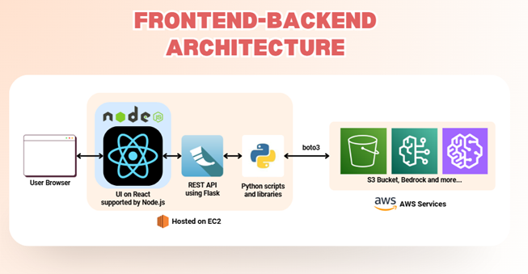
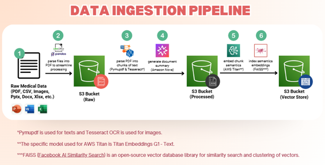
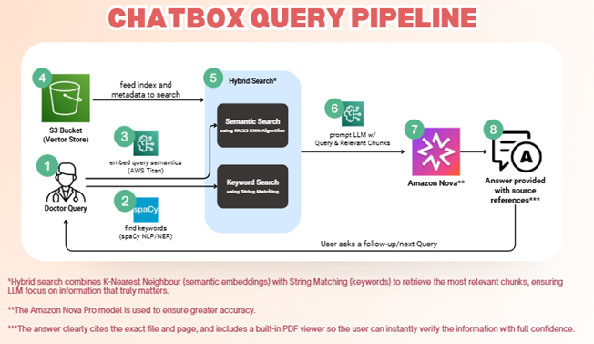

# MedInsight


**MedInsight** is an AI-powered medical document query tool that lets healthcare teams ask natural-language questions and instantly find answers inside large collections of PDFs—guidelines, reports, and scanned documents.  
The goal is to provide clinicians and administrators with actionable insights from medical documents, enabling them to access critical information without manually searching through countless files.  
It combines **smart PDF search with OCR**, **structure-aware understanding of tables and sections**, and an **interactive AI assistant** that delivers concise answers with source citations, helping healthcare teams make faster and more confident decisions at the point of care.

---
## Table of Contents

- [Problem Statement](#problem-statement-ai-driven-automation-for-business-growth)
- [Solution](#solution)
- [Tech Stack](#tech-stack)
- [Setup Instructions](#setup-instructions)
- [Reflection](#reflection)
- [License](#license)

---
## Problem Statement: AI-Powered Medical Document Query Tool
Healthcare professionals in Malaysia face the challenge of:  
- Critical patient data and clinical guidelines buried in unstructured PDFs.  
- Manual searches that are time-consuming and error-prone.  
- Difficulty extracting accurate insights from scanned, legacy, or complex medical documents.

---

## Solution

MedInsight solves this by:

- Providing a seamless plug-in layer that integrates with existing hospital HIS/EMR systems without requiring replacement.  
- **Smart PDF extraction** using OCR + NLP to handle both scanned and digital PDFs, extracting tables, charts, and free text into queryable data.  
- **Upload PDFs** directly via the interface: files are automatically saved to the cloud (AWS S3) and trigger OCR and embedding generation for meaningful, semantic queries.  
- **Natural language, chat-style query interface** allowing doctors to ask questions in plain English or Malay (e.g., “Show me Mr. Ali’s last 3 HbA1c results.”).  
- **Contextual answering** that highlights relevant PDF sections, reducing scrolling and manual searching.  
- Transforming unstructured medical documents into an accessible knowledge base for faster, more confident clinical decisions.

---

## Tech Stack

- Frontend/Dashboard: React (Dashboard)
- Backend/API: FlaskAPI, AWS EC2, PM2
- Database: AWS S3
- AI Models: AWS Bedrock (Nova Pro, Titan Embeddings G1 - Text)
- Others: PyMuPDF (text extraction), Tesseract OCR (image text extraction), FAISS (vector similarity search), Hybrid search (KNN + string matching)
- 
---

## System Architecture




---

## Setup Instructions

### Self-Host
### 1. Clone the Repository
```bash
# Clone the repo
git clone https://github.com/huiying888/MedInsight.git
cd MedInsight
```
### 2. Configure AWS CLI
Make sure you have AWS CLI installed and configured:
```bash
aws configure
```
Enter your AWS Access Key, Secret Key, region, and output format.
### 3. Setup Frontend (React Dashboard)
```bash
cd med-insight-ui
npm install
npm run build
node server.js
```
### 4. Setup Backend (Flask API)
```bash
cd MedInsight
waitress-serve --host=0.0.0.0 --port=3000 flask_server:app
```

### Access the application on AWS EC2
- This application is also hosted on AWS EC2.
- Access the frontend in your browser at [http://34.207.182.237:5000/](http://34.207.182.237:5000/)

---

## Reflection

**Challenges:**
- Processing multi-source PDFs, including scanned docs, with OCR and PyMuPDF.  
- Implementing AI search with AWS Bedrock (Nova Pro, Titan) and FAISS for fast, accurate retrieval.  
- Deploying frontend (React) and backend (Flask) on AWS EC2 with PM2/Waitress and managing real-time query handling.  

**Learnings:**
- AWS Bedrock simplifies LLM integration for natural-language querying.  
- Combining structured dashboards with AI Q&A enhances flexibility and usability.  
- Using AWS S3 with FAISS enables scalable storage and semantic search for large document collections.  
- Chat-like interface with source citations improves trust and decision-making efficiency.

---

## Team: Final Fantasy 4

- Jocelyn Ngieng Hui Ying : [@huiying888](https://github.com/huiying888)
- Ng Ker Jing : [@kerjing0328](https://github.com/kerjing0328)
- Sia Sheng Jie : [@sia1010](https://github.com/sia1010)
- Teoh Yi Jen : [@Yijen10](https://github.com/Yijen10)

---

## License
MIT License — free to use and modify.
